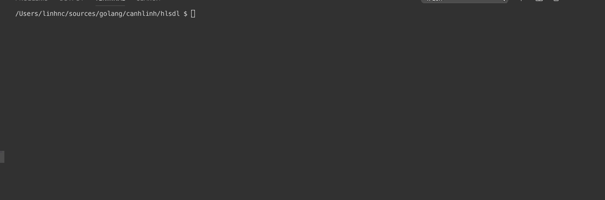

# HLS downloader
This is a library to support downloading a m3u8 file. All ts segments will be downloaded into a folder then be joined into a single TS file. Default file name is `video.ts`


### Features:
* Concurrent download segments with multiple http connections
* Decrypt hls encoded segments
* Auto retry download
* Display downloading progress bar


### Todo:
* Allow adding http headers

### How to use

Get library
```
go get github.com/canhlinh/hlsdl
```

Sample:

```
package main

import (
	"github.com/canhlinh/hlsdl"
)

func main() {
	hlsDL := hlsdl.New("https://bitdash-a.akamaihd.net/content/sintel/hls/video/10000kbit.m3u8", "download", 10)
	if err := hlsDL.Download(); err != nil {
		panic(err)
	}
}

```

### How to build a console application

Build for linux
```
make build-linux
```

Build for windows
```
make build-windows
```

Run the application

```
./bin/hlsdl --help
```

```
./bin/hlsdl -u https://bitdash-a.akamaihd.net/content/sintel/hls/video/1500kbit.m3u8 -d download -w 10
```


